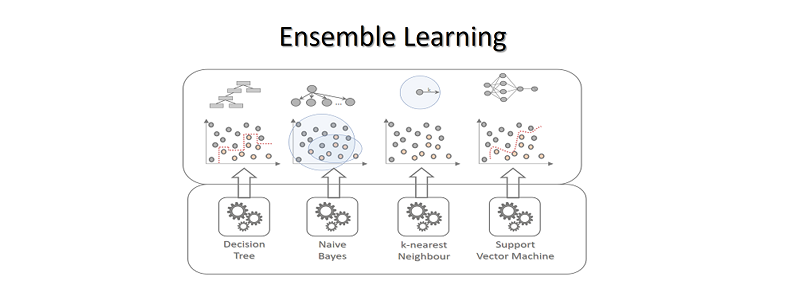

```{r setup, include=FALSE}
knitr::opts_chunk$set(
  echo = FALSE, Evale=TRUE, warning=FALSE, message=FALSE
 #,fig.align='center' #,out.width='50%' ,out.height='50%'
)

#------------------------------------------------------------------
{ # Custom Settings
  i2 <- c() # information of h2o

  percentage <- i2['percentage'] <- 0.1  # Percentage of imported data used
  use.smote  <- i2['use.smote']  <- TRUE # For class imbalance
  train.part <- i2['train.part'] <- 0.6  # train, valid=test=(1-train)/2
  nfolds     <- i2['nfolds']     <- 10    #  nfolds cross-vlidation

  prefix        <- i2['prefix']         <- 'SL' # The heading of all output
  output.folder <- i2['output.folder' ] <- 'result/'

  saveRDS(i2,'i2.rds')

  set.seed(seed <- 55) # Initializing a default seed value
}

{ # LIBRARIES
  if (!require('filesstrings')) install.packages('filesstrings'); library(filesstrings)
  if (!require('dplyr')) install.packages('dplyr'); library(dplyr)
  if (!require('plotly')) install.packages('plotly'); library(plotly)

  if (!require('munsell')) install.packages("munsell"); library(munsell)
  if (!require('ggplot2')) install.packages('ggplot2'); library(ggplot2)

  if (!require('SuperLearner')) install.packages('SuperLearner'); library(SuperLearner)
  if (!require('ranger' )) install.packages('ranger' ); library(ranger )
  if (!require('xgboost')) install.packages('xgboost'); library(xgboost)
  if (!require('caret'  )) install.packages('caret'  ); library(caret  )

  if(FALSE){  # OPTIONAL

    if (!require('nnet')) install.packages('nnet'); library(nent)
    if (!require('NeuralNetTools')) install.packages('NeuralNetTools'); library(NeuralNetTools)

    if (!require('e1071')) install.packages('e1071'); library(e1071)
    if (!require('party')) install.packages('party'); library(party)
    if (!require('gam')) install.packages('gam'); library(gam)
    if (!require('LogicReg')) install.packages('LogicReg'); library(LogicReg)
    if (!require('polspline')) install.packages('polspline'); library(polspline)
    if (!require('extraTrees')) install.packages('extraTrees'); library(extraTrees)
    if (!require('biglasso')) install.packages('biglasso'); library(biglasso)
    if (!require('dbarts')) install.packages('dbarts'); library(dbarts)
    if (!require('speedglm')) install.packages('speedglm'); library(speedglm)
    if (!require('mlbench')) install.packages('mlbench'); library(mlbench)
    if (!require('rpart')) install.packages('rpart'); library(rpart)

    #install.packages("devtools");library(devtools
    #);install_github("AppliedDataSciencePartners/xgboostExplainer",force = TRUE)

    if (!require('MASS')) install.packages('MASS'); library(MASS)
    if (!require('cvAUC')) install.packages('cvAUC'); library(cvAUC)
    if (!require('kernlab')) install.packages('kernlab'); library(kernlab)
    if (!require('arm')) install.packages('arm'); library(arm)
    if (!require('ipred')) install.packages('ipred'); library(ipred)
    if (!require('KernelKnn')) install.packages('KernelKnn'); library(KernelKnn)
    if (!require('RcppArmadillo')) install.packages('RcppArmadillo'); library(RcppArmadillo)

  }

}
```

This is the 2nd article of the following series and highlights the development and assessment of ensemble learning.

- [Predicting Hospital Readmissions with Machine Learning (Part 1): Data Preparation](https://yungchou.wordpress.com/2018/12/12/predicting-hospital-readmissions-with-ensemble-learning-part-1/)

- [Predicting Hospital Readmissions with Machine Learning (Part 2): Ensemble Learning Using H2O](https://yungchou.github.io/show/sl276.p2d.html)

In [Part 1](https://yungchou.wordpress.com/2018/12/12/data-preparation-of-diabetes-dataset-for-machine-learning/), I detailed the process to analyze and prepare the dataset, [Diabetes 130-US hospitals for years 1999-2008 Data Set](https://archive.ics.uci.edu/ml/datasets/diabetes+130-us+hospitals+for+years+1999-2008), downloaded from [UCI Machine Learning Repository](https://archive.ics.uci.edu/ml/index.php) for Machine Learning. Here, to continue, I developed a Machine Learning model with ensemble learning for predicting [hospital readmissions](https://www.cms.gov/medicare/medicare-fee-for-service-payment/acuteinpatientpps/readmissions-reduction-program.html). A locally run  [**H2O**](http://docs.h2o.ai/h2o/latest-stable/h2o-docs/index.html) cluster on my laptop was the development environment. The developed model included a stacked ensemble with the following four [**algorithms** or **learners**](http://docs.h2o.ai/h2o/latest-stable/h2o-docs/data-science.html):

- [Random Forest](http://docs.h2o.ai/h2o/latest-stable/h2o-docs/data-science/drf.html) (RF)
- [Gradient Boosting Machine](http://docs.h2o.ai/h2o/latest-stable/h2o-docs/data-science/gbm.html) (GBM)
- [Generalized Linear Model](http://docs.h2o.ai/h2o/latest-stable/h2o-docs/data-science/drf.html) (GLM)
- [Deep Learning](http://docs.h2o.ai/h2o/latest-stable/h2o-docs/data-science/deep-learning.html) (DL)

The logical steps for constructing and conducting ensemble learning with pertinent information are highlighted as the following:

## Data Set

The data set employed for developing the ensemble described in this article was slightly different from the finalized data set in [Part 1](https://yungchou.wordpress.com/2018/12/12/data-preparation-of-diabetes-dataset-for-machine-learning/). Nevertheless, the process for preparing the data set was very much identical other than the feature set was based on results from a different [**Boruta**](https://www.jstatsoft.org/article/view/v036i11/v36i11.pdf) run. 

```{r}
 # DATA SET

  df.imported <- read.csv( imported.file <- './data/capstone.dataimp.csv' )[-1]
  cat('Imported file: dataimp.csv with'
      ,nrow(df.imported),'obs. and'
      ,ncol(df.imported),'variables')
```

The imported data set had the following structure where '**readmitted**' was the label:

```{r}
  # Set label as factor
  df.imported$readmitted <- as.factor(df.imported$readmitted)

  str(df.imported)
```

### Subsetting and Partitioning the Data

Since the Machine Learning results and statistics presented in this article are generated dynmaically, to reduce the wait time and computing resource requirements, here I used a subset of the imported data set for demonstrating the development of an ensemble. I further partitioned the data into three parts for trianing, cross-validation, and testing. The actual data employed for developing and conducting the ensemble learning were with the following configuration:

```{r}
  
  # Subsetting the data
  df.imported <- sample_frac(df.imported, percentage, replace=FALSE)

  # PARTITIONING DATA

  # Instead of just sampling directly from df.import, which
  # may potentially include very few under-sampling class, here 1's,
  # the following ensures there are proportional o's and 1's
  # included in training, testing and cross-validation data.
 
  valid.part <- test.part <- (1-train.part)/2

  zeropart <- sample(3, nrow( df.imported[df.imported$readmitted==0,]),
                  replace=TRUE, prob=c(train.part, valid.part, test.part))
  onepart  <- sample(3, nrow( df.imported[df.imported$readmitted==1,]),
                  replace=TRUE, prob=c(train.part, valid.part, test.part))

  # Ensure both zeros and ones are sampled for each partition
  train.org <- rbind( df.imported[zeropart==1,] , df.imported[onepart==1,] )
  valid     <- rbind( df.imported[zeropart==2,] , df.imported[onepart==2,] )
  test      <- rbind( df.imported[zeropart==3,] , df.imported[onepart==3,] )

cat('Sampling', nrow(train.org)+nrow(valid)+nrow(test), 'obs. with indicated percentage'
      ,'into three partitions:'
     ,'\n\nTrainging data  (',train.part*100,'%) =',nrow(train.org),'obs.'
     ,'\nValidation data (',valid.part*100,'%) =',nrow(valid),'obs.'
     ,'\nTesting data    (',test.part*100,'%) =',nrow(test),'obs.')
```

## Class Imbalance

While examining the training data, it ws apparent that the label, **readmitted**, was with highly disproportional distribution of values. **This was problematic, as class imbalance tends to overwhelm a model and leads to incorrect classification.** Since during training, the model would have learned much more about and become prone to classifying the over-sampled class. On the other hand, the model knows little about the situations to calssify the under-sampled class. Consequently, a model trained with imbalance class data would potentially produce a high misclassification rate. Additional informaiton of [Class Imbalance Problem](http://www.chioka.in/class-imbalance-problem/) is available elsewhere.

### SMOTE

To circumvent the imbalance issue, I used [SMOTE](https://www.rdocumentation.org/packages/DMwR/versions/0.4.1/topics/SMOTE) from the package, [Data Mining with R(DMwR)](https://cran.r-project.org/web/packages/DMwR/index.html), to generate more balanced sets of label values for training. Here is one SMOTE'd sample set on the right and derived from the left one with high class inbalance.

```{r out.width='50%'}
{# CLASS IMBALANNCE
  if(use.smote){ # METHOD 1: USING SMOTE TO REBALANCE TEE LABEL
    if (!require('DMwR')) install.packages('DMwR'); library(DMwR)

    train <- SMOTE(readmitted~., train.org,
                   perc.over=500, perc.under=130)

  } else { # METOD 2: SAMPLING EUQAL NUMBER OF 0's and 1's FROM THE LABEL
    n <- min(train.org[train.org$readmitted==1,],train.org[train.org$readmitted==0,])
    train <- train.balanced <- rbind(
      sample(n,train.org[train.org$readmitted==0,], replace=FALSE)
      ,sample(n,train.org[train.org$readmitted==1,], replace=FALSE)
    )
  }

  #table(train.org$readmitted)
  #table(train$readmitted)

  par(mfrow=c(1,2)
  );plot(train.org['readmitted'] ,las=1 ,col='lightblue' ,xlab='label(readmitted)'
         ,main=sprintf('Class Imbalance of Imported \nTraining Label\n(%i vs. %i)'
                       ,table(train.org$readmitted)[1],table(train.org$readmitted)[2])
  );plot(train['readmitted'] ,las=1 ,col='lightgreen' ,xlab='label(readmitted)'
         ,main=sprintf("SMOTE'd/Finalized\nTraining Label\n(%i vs. %i)"
                       ,table(train$readmitted)[1],table(train$readmitted)[2])
  );par(mfrow=c(1,1))
}

if(FALSE){ # THE DISTRIBUTION OF LABEL VALUES IN EACH PARTITION OF THE EMPLOYED DATA
  label.dist <- rbind(
    summary(train$readmitted),summary(valid$readmitted))
  label.dist <- cbind(label.dist,c(nrow(train),nrow(valid)))
  rownames(label.dist) <- c('train','valid')
  colnames(label.dist) <- c('0','1','obs.')
  label.dist
}
```

Notice the balance between oversampling and undersampling data are configurable with **perc.over** and **perc.under** as detailed in [the documentation](https://www.rdocumentation.org/packages/DMwR/versions/0.4.1/topics/SMOTE).

## Ensemble Learning

For a complex problem like hospital readmissions, realizing and optimizing [**biases-variance tradeoff**](http://www.cs.cornell.edu/courses/cs4780/2017sp/lectures/lecturenote11.html) is a challenge. And using ensemble learning to complement some algorithms' weakness with the others' strength by evaluating, weighting, combining, and optimizing their results seemed a right strategy and logical approach. The following illustrated [the concept of ensemble learning](https://data-science-blog.com/blog/2017/12/03/ensemble-learning/).

```{r echo=FALSE, fig.cap="Source: https://data-science-blog.com/blog/2017/12/03/ensemble-learning/", out.width = '75%'}

```

### H2O

As opposed to preparing data with R/RStudio, I ran a local cluster wiht my laptop using [H2O](http://docs.h2o.ai/?_ga=2.238761280.15794294.1549575624-1356421811.1549575624) which provides a user-friendly framework and essentially eliminates from a Machine Learning developer the mechanics for setting up a cluster and orchestrating cross-validation of each algorithm. One important benefit for me to use H2O is in particular the speed and the relative low resource requirements. Overall, H2O worked well throughout this project.

### Cluster Initialization

```{r}
{ # H2O INITIATION
  if (!require('h2o')) install.packages('h2o'); library(h2o)
  if (!require('cvAUC')) install.packages('cvAUC'); library(cvAUC)
  #if (!require('h2oEnsemble')) install.packages(
   # "https://h2o-release.s3.amazonaws.com/h2o-ensemble/R/h2oEnsemble_0.1.8.tar.gz"
    #, repos = NULL); library(h2oEnsemble)

  if (!require('h2oEnsemble')){
    library(devtools)
    install_github("h2oai/h2o-3/h2o-r/ensemble/h2oEnsemble-package")
  };library(h2oEnsemble)

  # h2o initialization
  my.local.h2o <- h2o.init(ip='localhost',port=13579, nthreads=-1)
  #h2o.removeAll()

  #h2o.clusterInfo()
  #demo(h2o.gbm)
  #h2o.shutdown()
}
```

### Data Frames Conversion

For fitting a model, data frames must be loaded into an H2O cluster. Since the data were prepared and stored in memory as R resources, I needed to convert them to H2O objects first. I also set up the label, **readmitted**, as the response variable and the rest as predictors.

```{r echo=TRUE,results='hide'}
{ # CONVERTING DATA PARTITIONS TO H2O OBJECTS
  training_frame   <- as.h2o(train)
  validation_frame <- as.h2o(valid)
  testing_frame    <- as.h2o(test)

  # SETTING UP THE LABEL
  y <- 'readmitted'
  x <- setdiff(names(training_frame), y)
}
```
```{r}
{ # SETTING UP OUTPUT FILE PATH
  prefix   <- i2['prefix']   <- paste0('SL', nrow(train.org))
  save.dir <- i2['save.dir'] <- paste0(output.folder,prefix,'.')

  saveRDS(training_frame  ,paste0(save.dir,'training_frame.rds'))
  saveRDS(validation_frame,paste0(save.dir,'validation_frame.rds'))
  saveRDS(testing_frame   ,paste0(save.dir,'testing_frame.rds'))
}
```

### Algorithms/Learners

Hospital readmissions is a classification problem in which a patient is either readmitted or not. To develop ensemble learning, the task at this time was to investigate and select a set of [**algorithms**, or **learners**](http://docs.h2o.ai/h2o/latest-stable/h2o-docs/data-science.html#algorithms), complementary to one another to form an ensemble model. There have been a few algorithms known for solving classification problems including Random Forest and Grandient Boosting. In this project, all four algorithms nicely included in H2O were configured as learners with most default settings to form the ensemble.

```{r}
 # ENSEMBLE SETTINGS
  family <- c(AUTO='AUTO',binomial='binomial',guasian='guassian')
#  learner <- c(
#     gbm='h2o.gbm.wrapper'
#    ,glm='h2o.glm.wrapper'
#    ,rf ='h2o.randomForest.wrapper'
#    ,dl='h2o.deeplearning.wrapper'
#  )

if (FALSE) {

  #h2o.shutdown()
  { # MODEL FITTING
    fit <- h2o.ensemble( x=x, y=y, seed=seed, learner=learner
     ,training_frame = training_frame, validation_frame = validation_frame
     ,cvControl = list(V=nfolds, shuffle=TRUE)
     ,family= family['binomial'] ,model_id='ensemble' ,metalearner=learner['rf']
    );fit
  }

    perf <- h2o.ensemble_performance(fit, newdata=testing_frame);perf
    #plot(perf)

    #perf$fit@metrics$AUC
    #print(perf, metric = "MSE")
    pred <- predict.h2o.ensemble(fit, newdata=testing_frame)

    # Confusion Matrix
    perf$ensemble@metrics$cm

    # F1 score

    #AUC
    labels <- as.data.frame(validation_frame[,c(y)])[,1]
    # Ensemble test AUC
    AUC(predictions=as.data.frame(pred$pred)[,1], labels=labels)
    L <- length(learner)
    sapply(seq(L), function(l) AUC(predictions = as.data.frame(pred$basepred)[,l], labels = labels))

    model <- lapply(fit@model_ids,h2o.getModel)

}

cat('nfolds =',nfolds
   ,'\nseed   =',seed)
```
```{r echo=TRUE, results='hide'}
{ #----------
  # LEARNERS
  #----------
  rf <- h2o.randomForest( x, y, model_id='rf' ,nfolds=nfolds ,seed=seed
    ,training_frame = training_frame, validation_frame = validation_frame
    ,fold_assignment='Modulo', keep_cross_validation_predictions=TRUE)
  gbm <- h2o.gbm(x, y,model_id='gbm',nfolds=nfolds ,seed=seed
    ,training_frame = training_frame, validation_frame = validation_frame
    ,fold_assignment='Modulo', keep_cross_validation_predictions=TRUE)
  glm <- h2o.glm(x, y, ,model_id='glm',nfolds=nfolds ,seed=seed ,family= family['binomial']
    ,training_frame = training_frame, validation_frame = validation_frame
    ,fold_assignment='Modulo', keep_cross_validation_predictions=TRUE)
  dl <- h2o.deeplearning(x, y, model_id='dl',nfolds=nfolds ,seed=seed
    ,training_frame = training_frame, validation_frame = validation_frame
    ,fold_assignment='Modulo', keep_cross_validation_predictions=TRUE)

  models <- list(rf@model_id, gbm@model_id, glm@model_id, dl@model_id)
  learners <- c(rf, gbm, glm, dl);saveRDS(learners,paste0(save.dir,'learners.rds'))

}
```

```{r}
if(FALSE){

  h2o.confusionMatrix(rf,  valid=FALSE)
  h2o.confusionMatrix(gbm, valid=FALSE)
  h2o.confusionMatrix(glm, valid=FALSE)
  h2o.confusionMatrix(dl,  valid=FALSE)

  summary(rf)
  rf@model$model_summary
  rf@model$scoring_history
  rf@model$training_metrics
  rf@model$training_metrics@metrics$cm$table
  rf@model$variable_importances
}
```

### Stacked Ensemble

The four learners were [stacked](http://docs.h2o.ai/h2o/latest-stable/h2o-docs/data-science/stacked-ensembles.html) up to form an ensemble and carry out learning. For the stacking to work, all learners must use the same cross-validation settings including nfolds, data frames, etc.

```{r echo=TRUE, results='hide'}
  #-----------------
  # STACKED ENSEMBLE
  #-----------------
  stacked <- h2o.stackedEnsemble(x, y, seed=seed
      ,model_id='stacked',base_models=models
      ,training_frame = training_frame, validation_frame = validation_frame
  );saveRDS(stacked,paste0(save.dir,'stacked.rds'))
```

## Model Performance Assessment

For a binary classification using data with [Class Imbalance Problem](http://www.chioka.in/class-imbalance-problem/) as what this model experienced, "**accuracy**" is not the best measure due to "[**Accuracy Paradox**](https://www.newgenapps.com/blog/precision-vs-recall-accuracy-paradox-machine-learning)." There are [various measures](http://docs.h2o.ai/h2o/latest-stable/h2o-docs/performance-and-prediction.html?highlight=auc#evaluation-model-metrics) available in H2O for assessing model performance. Here, I examined [**logloss**](http://docs.h2o.ai/h2o/latest-stable/h2o-docs/performance-and-prediction.html?highlight=logloss#logloss) and [**AUC**](http://docs.h2o.ai/h2o/latest-stable/h2o-docs/performance-and-prediction.html?highlight=AUC#auc-area-under-the-roc-curve) to evaluate the performance. The shown numbers of decimal points below were rounded for presentation and readerability.

```{r}
 { #-------------------------
  # PERFORAMNCE COMPARISONS
  #-------------------------
  all <- c(learners,stacked)

  # PERFROMANCE ON TRAINING DATA
  train.logloss <- sapply(all, h2o.logloss) # for logloss, the lower, the better
  train.auc     <- sapply(all, h2o.auc)     # For AUC, the bigger, the better
  # PERFROMANCE ON CROSS-VALIDATION DATA
  perf <- lapply(all, h2o.performance, testing_frame)
  cv.logloss <- sapply(perf, h2o.logloss)
  cv.auc     <- sapply(perf, h2o.auc)
  # A CONSOLIDATED VIEW
  all.perf <- noquote(cbind( c('rf','gbm','glm','dl','stacked')
         ,train.logloss=round(train.logloss,8)
         ,cv.logloss=round(cv.logloss,8)
         ,train.auc=round(train.auc,8)
         ,cv.auc=round(cv.auc,8)
         ));saveRDS(all.perf,paste0(save.dir,'all.perf.rds')
          );all.perf
}
```

For logloss, the smaller value, the better, while opposite for the AUC. As expected, the stacked ensemble in general performed a little better than than that on an individual learner. An ensemble generally should improve some performnce, yet the improvement should not be dramatic like, for example, from poor to exceptional. Regardless, a drastic performnce change of an algorithm in my opinion always warrants further examination.

- The cross-validation results generally should be poorer than that of training's due to overfitting. And for a complex problem and with many variables, like predicting hospital readmissions, the question is really not if, but how much and how bad the overfitting is. Using more data and increasing the cross-validation folds are two operational means to possibly manage the overfitting without chaning the model structure. For this stacked model, Deep Learning's logloss performance would sometimes fluctuate between training and cross-validation.

- On **auc**, the stacked model scored almost perfectly (0.9999) during training, which raised my suspecision. Fortunately the model resulted to 0.85 with cross-validation, which was more realistic and what I wanted to see. Ultimately the cv.auc of the stacked ensemble got to around 0.85 without much of a tuning. This set up a great start for further improvement.

```{r}
if (FALSE){
perf[[5]]@metrics$cm
perf[[5]]@metrics$AUC
perf[[5]]@metrics$thresholds_and_metric_scores[c('tpr','fpr')]
}
```

## ROC Curves

From the ROC curves below,it showed how Random Forest was a strong contributor of the ensemle and performed closely to what the Stacked model had ultimately delivered. It may appear that the other three models were not actively contributing, and perhaps even to be excluded in a final ensemble. This is however not necessarily true. After all, the context of a learning enviroment including the randomization, the composition, and the state of data all could influence an outcome.

```{r}
#------------
# ROC CURVES
#------------
if(FALSE){

  plot(rf@model$cross_validation_metrics,type='roc'
       ,col='blue',typ='l',lwd=2)
  par(new = TRUE)
  plot(gbm@model$cross_validation_metrics
       ,type = "roc", col = "red", typ = "l")
  par(new = TRUE)
  plot(glm@model$cross_validation_metrics
       ,type = "roc", col = "green", typ = "l")
  par(new = TRUE)
  plot(dl@model$cross_validation_metrics
       ,type = "roc", col = "orange", typ = "l")
  par(new = TRUE)
  plot(stacked.perf.test@metrics$thresholds_and_metric_scores[c('fpr','tpr')]
       ,type = "roc", col = "black", typ = "l")

  #----------
  mapply( function(x){
    plot(paste0(x,'@model$cross_validation_metrics'),type='roc'
       ,col='blue',typ='l',lwd=2)}
    ,list(
      stacked.perf.test@metrics$thresholds_and_metric_scores[c('tpr','fpr')]
      ,rf.perf.test@metrics$thresholds_and_metric_scores[c('tpr','fpr')]
      ,gbm.perf.test@metrics$thresholds_and_metric_scores[c('tpr','fpr')]
      ,glm.perf.test@metrics$thresholds_and_metric_scores[c('tpr','fpr')]
      ,dl.perf.test@metrics$thresholds_and_metric_scores[c('tpr','fpr')]
    )
  )

}

library(tidyverse)
roc.plotly <- ggplotly(

  roc.gg <- list(rf,gbm,glm,dl,stacked) %>%
    # map a function to each element in the list
    map(function(x) x %>% h2o.performance(valid=T) %>%
        #      map(function(x) x %>% h2o.ensemble_performance(newdata=validation_frame) %>%
        # from all these 'paths' in the object
        .@metrics %>% .$thresholds_and_metric_scores %>%
        # extracting true positive rate and false positive rate
        .[c('tpr','fpr')] %>%
        # add (0,0) and (1,1) for the start and end point of ROC curve
        add_row(tpr=0,fpr=0,.before=T) %>%
        add_row(tpr=0,fpr=0,.before=F)) %>%
    # add a column of model name for future grouping in ggplot2
    map2(c('random forest','gbm','glm','deep learning','stacked ensemble'),
       function(x,y) x %>% add_column(model=y)) %>%
    # reduce multiple data.frames to one
    reduce(rbind) %>%
    # plot fpr and tpr, map model to color as grouping
    ggplot(aes(fpr,tpr,col=model))+
    geom_line()+
    geom_segment(aes(x=0,y=0,xend=1, yend=1),linetype=2,col='grey')+
    xlab('False Positive Rate')+
    ylab('True Positive Rate')+
    ggtitle('ROC Curves of Ensemble Learning')

);saveRDS(roc.plotly,paste0(save.dir,'roc.plotly.rds')
);roc.plotly


if(FALSE){
if (!require('OptimalCutpoints')) install.packages('OptimalCutpoints'); library(OptimalCutpoints)

optimal_cutpoint<-optimal.cutpoints( X=stacked ,status='1'
  ,tag.healthy = 1 ,methods=c('Youden','MaxSpSe','SpEqualSe')
  ,data=testing_frame ,pop.prev=NULL ,categorical.cov='readmitted'
  ,control=control.cutpoints(), ci.fit=FALSE, conf.level=0.95, trace=FALSE)
}
```

## Next 

There are a number of action items to continue from here for improving the model including:

### Cutoff Point

This is to derive the cutoff point of the stacked model's ROC curve for optimizing defined criteria, e.g. maximizing [sensitivity and specificity](https://en.wikipedia.org/wiki/Confusion_matrix). And use the cutoff point to determine the threshold for classificaiton, such that the model would make predictions on average matched the set criteria.

The derivation and analysis of an optimal cut-off point is a topic in itself and beyond the scope of this project. Those who are interested in knowing more may find this reference, [One ROC Curve and Cutoff Analysis](https://ncss-wpengine.netdna-ssl.com/wp-content/themes/ncss/pdf/Procedures/NCSS/One_ROC_Curve_and_Cutoff_Analysis.pdf), helpful.

### Data and Cross-Validation folds

Simply the more data, the merrier model.

### Various Learners and Test Grids

Try different compositions of learners and test grids to develop optimal settings.

## Predictions and Visualization Example of Confusion Matrix

Here, for demonstration, I showed what the data distribution of predictions and visualized what the associated confusion matrix had looked like based on the test data with a cutoff point at 0.5 which was arbitrarily chosen, as opposed to being derived from an associated ROC curve. 

```{r results='hide'}
stacked.pred <- h2o.predict(stacked,newdata=testing_frame)
stacked.pred.test.df <- (as.data.frame(stacked.pred))
```
```{r out.width='100%'}
#----------------------------------------
# Visualizing error types of predictions
#----------------------------------------
#cat('Classification threshold:', threshold)
library(checkmate)

threshold <- 0.5

y.test.df <- as.data.frame(testing_frame$readmitted)

pred_type <- function(pred, obs, cutoff=threshold) {
  ptype <- rep(NA,nrow(obs))
  ptype <-
    ifelse(pred >= cutoff & obs == 1, "TP",
     ifelse(pred >= cutoff & obs == 0, "FP",
      ifelse(pred < cutoff & obs == 1, "FN",
       ifelse(pred < cutoff & obs == 0, "TN", '???'))))
  return (ptype)
}

pred.type <- cbind(

   stacked.pred.test.df$p1
  ,pred_type(stacked.pred.test.df$p1 ,y.test.df ,threshold)
  ,ifelse(stacked.pred.test.df$p1 < threshold ,'not readmitted','readmitted')
  ,y.test.df
  ,ifelse(y.test.df==0 ,'not readmitted','readmitted')

);colnames(pred.type) <- c('pred','type' ,'pred.class','obs','obs.class')

#----------------------------------------------------
# 2D scatter Plot of Prediciton by Ensemble Learning
#----------------------------------------------------
#if (!require('plotly')) install.packages('plotly');library(plotly)
#if (!require('RColorBrewer')) install.packages('RColorBrewer');library(RColorBrewer)

pred.type <- pred.type[order(pred.type$obs, decreasing = FALSE),]

xmark <- nrow(pred.type[pred.type$obs==0,])
xmax <- nrow(pred.type)

(p2d.class <- plot_ly( pred.type ,x = ~1:xmax ,y = ~pred.type[,'obs']
                       ,name='observation' ,type='scatter'
   # OPTIONAL BLEOW --------------
   ,color = ~pred.type[,'obs']
   ,colors=c('blue','red')  # 0 ,1
   # -----------------------------
   #  ,width=1500 ,height=700 #,margin=5
   ,hoverinfo = 'text' ,text = ~paste(
     'test data:' ,pred.type[,'obs']
    ,'\nclassification:' ,pred.type[,'obs.class'])
   ,mode = 'markers+lines'
   ,marker = list( size = 5 ,opacity = 0.5
   #,color = pred.type ,colorbar=list(title = "Viridis")
   #,color = colorRampPalette(brewer.pal(12,'Set1'))(2000)
   ,line = list( color='black' ,width=1))
) %>% add_trace(y = ~pred.type[,'pred'] ,name='prediction' ,mode = 'markers'
        ,hoverinfo = 'text' ,text = ~paste(
           'prediction:' ,pred.type[,'pred']
          ,'\nthreshold:' ,threshold
          ,'\nclassification:' ,pred.type[,'pred.class']
          ,'\n-------------------------------------------'
          ,'\ntest data:' ,pred.type[,'obs']
          ,'\nclassification:' ,pred.type[,'obs.class']
          ,'\n-------------------------------------------'
          ,'\ntype:' ,pred.type[,'type'])
) %>% layout( title=sprintf(
  'Confusion Matrix Example of Ensemble Learning with Test Data\n(%i Obs.)', nrow(y.test.df))
  ,xaxis=list(title='observation')
  ,yaxis=list(title='prediction')
  #,plot_bgcolor=info['backgroundcolor']
  ,annotations=list( text=sprintf('<b>%s</b>',c('FP','TN','TP','FN'))
    ,x=c(xmark*0.5 ,xmark*0.5 ,xmark+(xmax-xmark)*0.5 ,xmark+(xmax-xmark)*0.5)
    ,y=c( threshold+(1-threshold)*0.5,threshold*0.5
         ,threshold+(1-threshold)*0.5,threshold*0.5)
    ,font=list(size=30),showarrow=FALSE)
  ,shapes = list(
#    list( type = "line",line = list( color = 'black' ,width = 1, dash = 'dot'),
#          x0 = 0, x1 = nrow(pred.type), y0 = threshold, y1 = threshold )
   list( type = "line",line = list( color = 'black' ,width = 1.3),
          x0 = xmark, x1 = xmark, y0 = 0, y1 = 1 )
    )
) %>% add_trace( name='threshold'  #,showlegend=FALSE
                 ,y= threshold
                 ,line = list( color = 'black' ,width = 1, dash = 'dot')
                 ,marker = list( size = 1,color = 'balck')
                 ,hoverinfo = 'text' ,text=sprintf('threshold = %.2f', threshold)
));saveRDS(p2d.class, paste0(save.dir,'p2d.class.rds'
));htmlwidgets::saveWidget(p2d.class, paste0(prefix,'.p2d.class.html')
);file.move(paste0(prefix,'.p2d.class.html'), output.folder)
```

## Closing Thoughts

- H2O perfromed quite well and using just my i7 laptop I was able to conduct all the testing and data visualization without an issue. On the other hand, with a few thousand observations it may take a minute to load a [knitted](https://cran.r-project.org/web/packages/knitr/index.html) page due to the coplexity and the amount of data included.

- Ensemble learning is an interesting idea and a powerful tool to achieve a lot in a short period of time. Running multiple algorithms may also be confusing at times. Integrate a housekeeping mechanism to automatically capture and store intended objects such that some level of consistency and reproducability is with every run to keep sanity in check. Else troubleshooting may be an endless wondering, while hopelessly lost in an ocean of confusion. Make small changes and establish checkpoints accordingly nad often, while progrssing along.

Finally, time to talk about Convolutional Neural Network yet? Stay tuned. That's coming soon.
